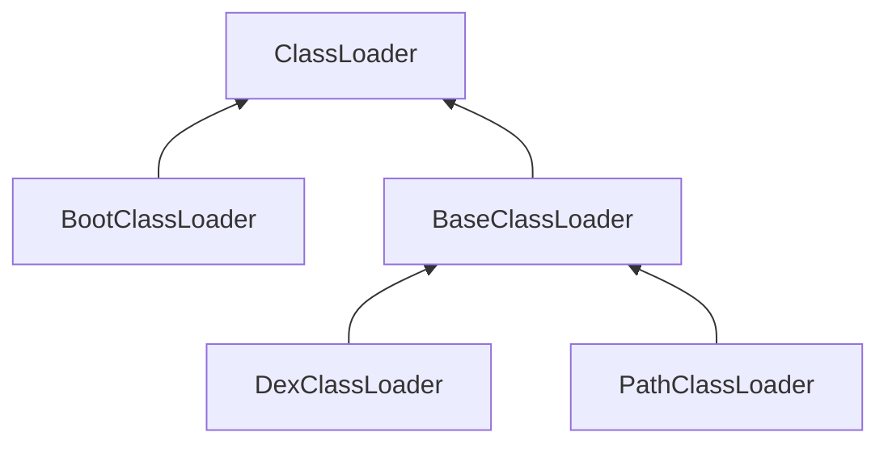

# Android ClassLoader学习笔记
为什么要学习这个，是因为最近实现art模式下注入dex，其中有一步是获取到系统的classloader，用来构建DexClassLoader加载dex文件，但是老失败。所以系统的学习一下android的classloader机制。

## classloader类型及关系
android中的classloader类型很多，只看几个常见的。
1. java.lang.ClassLoader 
2. BootClassLoader
3. dalvik.system.BaseDexClassLoader 
4. dalvik.system.DexClassLoader
5. dalvik.system.PathClassLoader

这五个类的继承关系如下图



ClassLoader：虚拟类

BootClassLoader：主要是用来加载framework中的类

BaseClassLoader：实现了ClassLoader中的许多方法，是加载逻辑的主要实现类

PathClassLoader：主要是用来加载app中的类

DexClassLoader：用来动态加载

## 双亲委派模型
双亲委派就是：如果一个类加载器收到了类加载的请求，它首先不会自己尝试加载这个类，而是把请求委派给父类加载器去加载，每一个层次的类加载器都是这样，那么所有的请求其实最后都是会到启动类加载器中，如果父类加载器反馈无法加载，子加载器才会尝试自己加载。ClassLoader.loadClass代码如下：

``` java
protected Class<?> loadClass(String name, boolean resolve)
    throws ClassNotFoundException
    {
            // First, check if the class has already been loaded
            Class<?> c = findLoadedClass(name);
            if (c == null) {
                try {
                    if (parent != null) {
                        c = parent.loadClass(name, false);
                    } else {
                        c = findBootstrapClassOrNull(name);
                    }
                } catch (ClassNotFoundException e) {
                    // ClassNotFoundException thrown if class not found
                    // from the non-null parent class loader
                }
                if (c == null) {
                    // If still not found, then invoke findClass in order
                    // to find the class.
                    c = findClass(name);
                }
            }
            return c;
    }

```

要是先动态加载，需要先创建DexClassLoader，DexClassLoadre的构造函数需要传递一个父加载器，那么这个父加载器是什么? 如何获取这个父加载器。

## android app到底存在几个加载器实例

通过如下代码验证：

``` java
    @Override
    protected void onCreate(Bundle savedInstanceState) {
        super.onCreate(savedInstanceState);
        ClassLoader classLoader = getClassLoader();
        if (classLoader != null){
            Log.i(TAG, "[onCreate] classLoader " + i + " : " + classLoader.toString());
            while (classLoader.getParent()!=null){
                classLoader = classLoader.getParent();
                Log.i(TAG,"[onCreate] classLoader " + i + " : " + classLoader.toString());
            }
        }
    }

```
输出：

```
[onCreate] classLoader 1 : dalvik.system.PathClassLoader[DexPathList[[zip file "/data/app/me.kaede.anroidclassloadersample-1/base.apk"],nativeLibraryDirectories=[/vendor/lib, /system/lib]]]

[onCreate] classLoader 2 : java.lang.BootClassLoader@14af4e32 
```

可以看到至少存在两个类加载器，如果我们要在native代码中构建DexClassLoader，可以将用来加载app的PathClassLoader做为父加载器

## 动态加载相关源码分析
动态加载核心步骤：
1. DexClassLoader(String dexPath, String optimizedDirectory, String librarySearchPath, ClassLoader parent)
2. DexClassLoader.loadClass()

DexClassLoader源码:直接调用父类BaseDexClassLoader的构造函数
``` java
public class DexClassLoader extends BaseDexClassLoader {

    public DexClassLoader(String dexPath, String optimizedDirectory,
            String libraryPath, ClassLoader parent) {
        super(dexPath, new File(optimizedDirectory), libraryPath, parent);
    }
}
```
BaseClassLoader构造函数
``` java
public class BaseDexClassLoader extends ClassLoader {
    private final DexPathList pathList;
    public BaseDexClassLoader(String dexPath, File optimizedDirectory,
            String libraryPath, ClassLoader parent) {
        super(parent);
        this.pathList = new DexPathList(this, dexPath, libraryPath, optimizedDirectory);
    }
```

