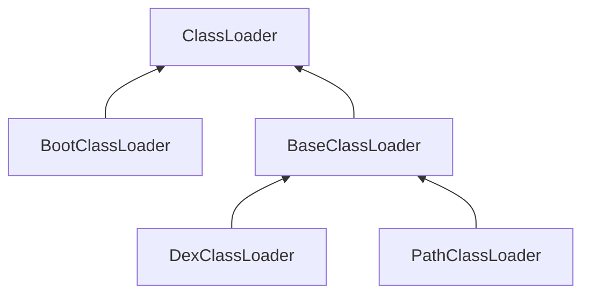

# Android ClassLoader学习笔记
为什么要学习这个，是因为最近实现art模式下注入dex，其中有一步是获取到系统的classloader，用来构建DexClassLoader加载dex文件，但是老失败。所以系统的学习一下android的classloader机制。

## classloader类型及关系
android中的classloader类型很多，只看几个常见的。
1. java.lang.ClassLoader 
2. BootClassLoader
3. dalvik.system.BaseDexClassLoader 
4. dalvik.system.DexClassLoader
5. dalvik.system.PathClassLoader

这五个类的继承关系如下图



ClassLoader：虚拟类

BootClassLoader：主要是用来加载framework中的类

BaseClassLoader：实现了ClassLoader中的许多方法，是加载逻辑的主要实现类

PathClassLoader：主要是用来加载app中的类

DexClassLoader：用来动态加载

## 双亲委派模型
双亲委派就是：如果一个类加载器收到了类加载的请求，它首先不会自己尝试加载这个类，而是把请求委派给父类加载器去加载，每一个层次的类加载器都是这样，那么所有的请求其实最后都是会到启动类加载器中，如果父类加载器反馈无法加载，子加载器才会尝试自己加载。ClassLoader.loadClass代码如下：

``` java
protected Class<?> loadClass(String name, boolean resolve)
    throws ClassNotFoundException
    {
            // First, check if the class has already been loaded
            Class<?> c = findLoadedClass(name);
            if (c == null) {
                try {
                    if (parent != null) {
                        c = parent.loadClass(name, false);
                    } else {
                        c = findBootstrapClassOrNull(name);
                    }
                } catch (ClassNotFoundException e) {
                    // ClassNotFoundException thrown if class not found
                    // from the non-null parent class loader
                }
                if (c == null) {
                    // If still not found, then invoke findClass in order
                    // to find the class.
                    c = findClass(name);
                }
            }
            return c;
    }

```

要是先动态加载，需要先创建DexClassLoader，DexClassLoadre的构造函数需要传递一个父加载器，那么这个父加载器是什么? 如何获取这个父加载器。

## android app到底存在几个加载器实例

通过如下代码验证：

``` java
    @Override
    protected void onCreate(Bundle savedInstanceState) {
        super.onCreate(savedInstanceState);
        ClassLoader classLoader = getClassLoader();
        if (classLoader != null){
            Log.i(TAG, "[onCreate] classLoader " + i + " : " + classLoader.toString());
            while (classLoader.getParent()!=null){
                classLoader = classLoader.getParent();
                Log.i(TAG,"[onCreate] classLoader " + i + " : " + classLoader.toString());
            }
        }
    }

```
输出：

```
[onCreate] classLoader 1 : dalvik.system.PathClassLoader[DexPathList[[zip file "/data/app/me.kaede.anroidclassloadersample-1/base.apk"],nativeLibraryDirectories=[/vendor/lib, /system/lib]]]

[onCreate] classLoader 2 : java.lang.BootClassLoader@14af4e32 
```

可以看到至少存在两个类加载器，如果我们要在native代码中构建DexClassLoader，可以将用来加载app的PathClassLoader做为父加载器，最简单的办法通过调用java.lang.ClassLoader.getSystemClassLoader()获取。

## 动态加载相关源码分析
动态加载核心步骤：
1. DexClassLoader(String dexPath, String optimizedDirectory, String librarySearchPath, ClassLoader parent)
2. DexClassLoader.loadClass()

DexClassLoader源码:直接调用父类BaseDexClassLoader的构造函数
``` java
public class DexClassLoader extends BaseDexClassLoader {

    public DexClassLoader(String dexPath, String optimizedDirectory,
            String libraryPath, ClassLoader parent) {
        super(dexPath, new File(optimizedDirectory), libraryPath, parent);
    }
}
```
BaseClassLoader构造函数
``` java
public class BaseDexClassLoader extends ClassLoader {
    private final DexPathList pathList;
    public BaseDexClassLoader(String dexPath, File optimizedDirectory,
            String libraryPath, ClassLoader parent) {
        super(parent);
        this.pathList = new DexPathList(this, dexPath, libraryPath, optimizedDirectory);
    }
```
DexPathList这个类，源码中注释是这样描述的：一对条目列表，与一个classloader相关联。其中一个列表是dex/resource路径，另一个是目录，包含了一些native code库。这个类还包含了一些利用这些列表来查找类和资源的方法。根据描述可以知道ClassLoader具体的loadclass工作可能是这个类实现的。源码如下：

DexPathList源码
``` java
final class DexPathList {
    public DexPathList(ClassLoader definingContext, String dexPath,
            String libraryPath, File optimizedDirectory) {
        if (definingContext == null) {
            throw new NullPointerException("definingContext == null");
        }

        if (dexPath == null) {
            throw new NullPointerException("dexPath == null");
        }

        if (optimizedDirectory != null) {
            if (!optimizedDirectory.exists())  {
                throw new IllegalArgumentException(
                        "optimizedDirectory doesn't exist: "
                        + optimizedDirectory);
            }

            if (!(optimizedDirectory.canRead()
                            && optimizedDirectory.canWrite())) {
                throw new IllegalArgumentException(
                        "optimizedDirectory not readable/writable: "
                        + optimizedDirectory);
            }
        }

        this.definingContext = definingContext;
        ArrayList<IOException> suppressedExceptions = new ArrayList<IOException>();
        this.dexElements = makeDexElements(splitDexPath(dexPath), optimizedDirectory,
                                           suppressedExceptions);
        if (suppressedExceptions.size() > 0) {
            this.dexElementsSuppressedExceptions =
                suppressedExceptions.toArray(new IOException[suppressedExceptions.size()]);
        } else {
            dexElementsSuppressedExceptions = null;
        }
        this.nativeLibraryDirectories = splitLibraryPath(libraryPath);
    }

```
DexPathList的构造函数，先进行了一些参数检查，然后构造了dexElements对象用来索引dex，构造了nativeLibraryDirectories用来索引native code库。makeDexElements最终调用loadDexFile加载了dex文件。
```java
private static Element[] makeDexElements(ArrayList<File> files, File optimizedDirectory,
                                             ArrayList<IOException> suppressedExceptions) {
        ArrayList<Element> elements = new ArrayList<Element>();
        /*
         * Open all files and load the (direct or contained) dex files
         * up front.
         */
        for (File file : files) {
            File zip = null;
            DexFile dex = null;
            String name = file.getName();

            if (file.isDirectory()) {
                // We support directories for looking up resources.
                // This is only useful for running libcore tests.
                elements.add(new Element(file, true, null, null));
            } else if (file.isFile()){
                if (name.endsWith(DEX_SUFFIX)) {
                    // Raw dex file (not inside a zip/jar).
                    try {
                        dex = loadDexFile(file, optimizedDirectory);
                    } catch (IOException ex) {
                        System.logE("Unable to load dex file: " + file, ex);
                    }
                } else {
                    zip = file;

                    try {
                        dex = loadDexFile(file, optimizedDirectory);
                    } catch (IOException suppressed) {
                        /*
                         * IOException might get thrown "legitimately" by the DexFile constructor if
                         * the zip file turns out to be resource-only (that is, no classes.dex file
                         * in it).
                         * Let dex == null and hang on to the exception to add to the tea-leaves for
                         * when findClass returns null.
                         */
                        suppressedExceptions.add(suppressed);
                    }
                }
            } else {
                System.logW("ClassLoader referenced unknown path: " + file);
            }

            if ((zip != null) || (dex != null)) {
                elements.add(new Element(file, false, zip, dex));
            }
        }

        return elements.toArray(new Element[elements.size()]);
    }
```

至此可以大致知道classloader的构造了，每一个classloader都对应一个DexPathList对象，DexPathList对象里面有个Element列表，其中每个Element对应一个dex。接下来就分析下DexClassLoader.loadClass函数。DexClassLoader与BaseDexClassLoader都没有重新定义loadClass函数.ClassLoader.loadClass源码如下：
``` java
protected Class<?> loadClass(String className, boolean resolve) throws ClassNotFoundException {
        Class<?> clazz = findLoadedClass(className);

        if (clazz == null) {
            ClassNotFoundException suppressed = null;
            try {
                clazz = parent.loadClass(className, false);
            } catch (ClassNotFoundException e) {
                suppressed = e;
            }

            if (clazz == null) {
                try {
                    clazz = findClass(className);
                } catch (ClassNotFoundException e) {
                    e.addSuppressed(suppressed);
                    throw e;
                }
            }
        }

        return clazz;
    }

```
BaseDexClassLoadr的findClass源码如下：
``` java
@Override
    protected Class<?> findClass(String name) throws ClassNotFoundException {
        List<Throwable> suppressedExceptions = new ArrayList<Throwable>();
        Class c = pathList.findClass(name, suppressedExceptions);
        if (c == null) {
            ClassNotFoundException cnfe = new ClassNotFoundException("Didn't find class \"" + name + "\" on path: " + pathList);
            for (Throwable t : suppressedExceptions) {
                cnfe.addSuppressed(t);
            }
            throw cnfe;
        }
        return c;
    }
```
可以看到实际的dex加载，类加载工作都是DexPathList这个类完成的。DexPathList.findClass源码如下：
``` java
public Class findClass(String name, List<Throwable> suppressed) {
        for (Element element : dexElements) {
            DexFile dex = element.dexFile;

            if (dex != null) {
                Class clazz = dex.loadClassBinaryName(name, definingContext, suppressed);
                if (clazz != null) {
                    return clazz;
                }
            }
        }
        if (dexElementsSuppressedExceptions != null) {
            suppressed.addAll(Arrays.asList(dexElementsSuppressedExceptions));
        }
        return null;
    }
```
DexPathList查找的方式就是循环遍历Element数组，取出dex，然后查找是否包含这个类。

## 结束
源码就分析到这里，再深挖就是dex加载，DEXFile类，后续分析art时再深究。
